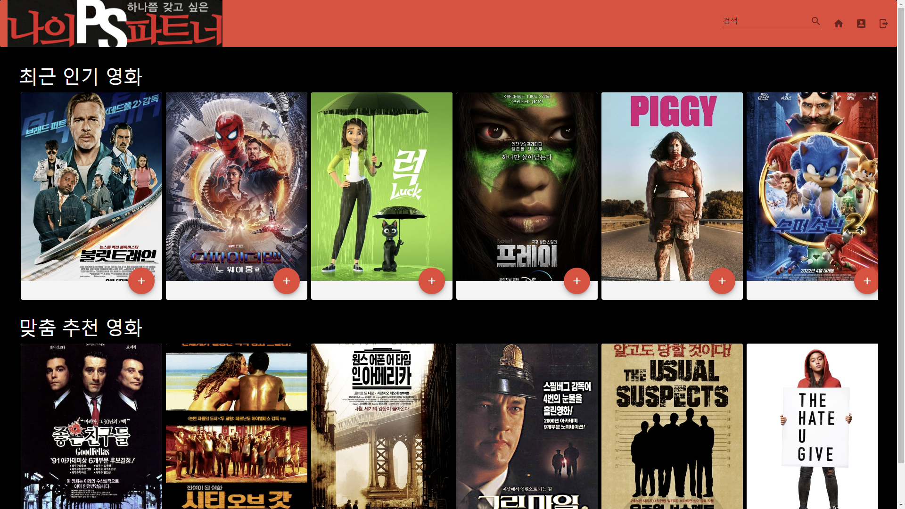
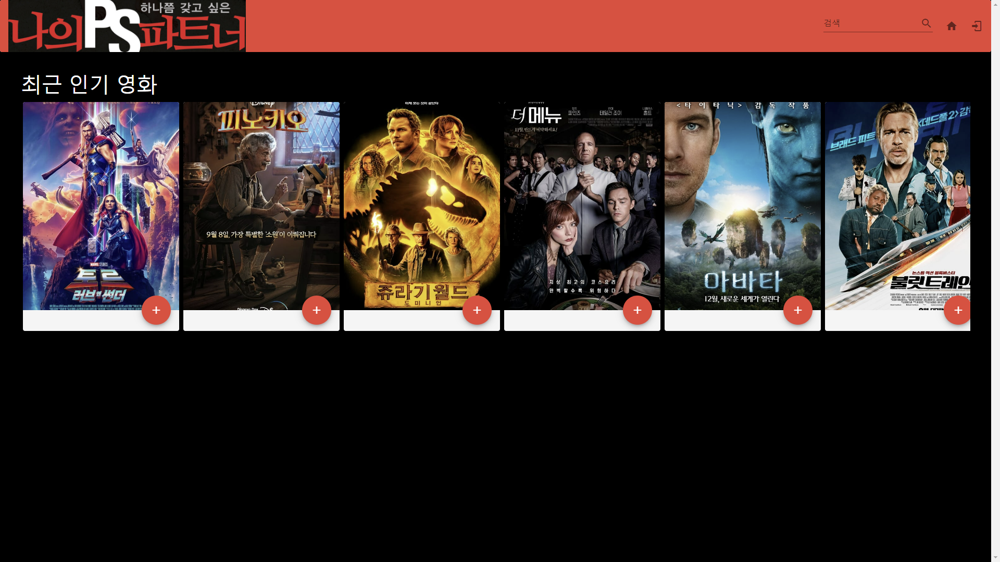
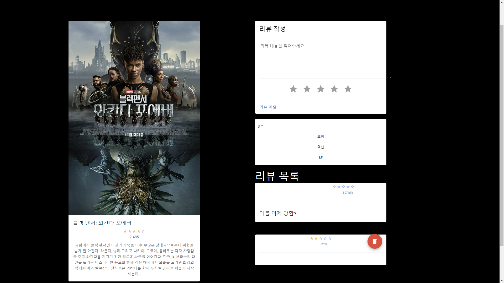
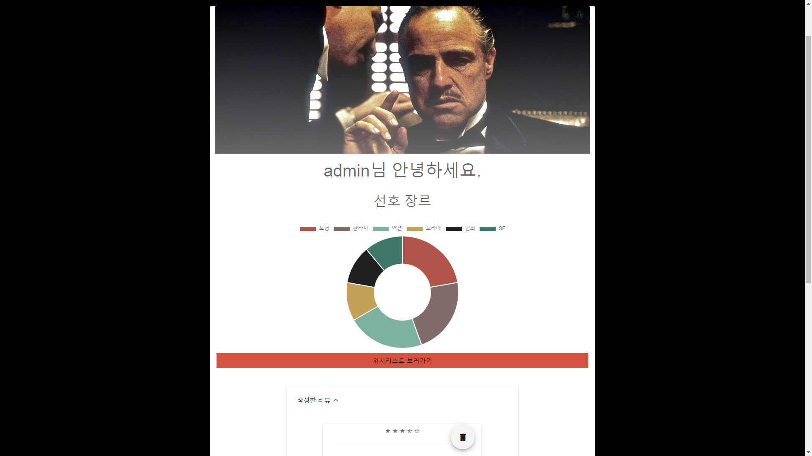
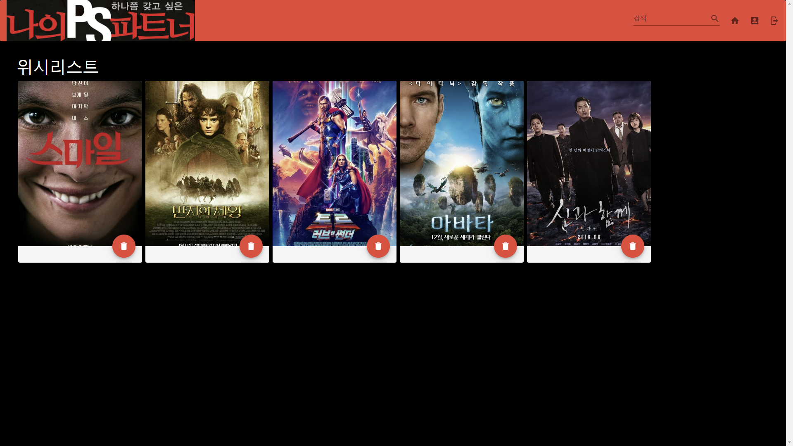
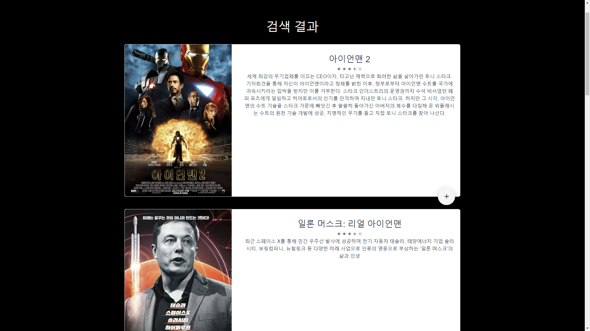

# ssafy-final-pjt
## 나의 Play-list Selecting 파트너

- 최신 유행 영화 추천
- 유저가 리뷰한 영화를 기준으로 유사한 장르의 영화를 추천
- TMDB API로 영화 정보 실시간 업데이트

## 팀원
- 이승희 (프론트엔드 담당)
    - 백엔드 데이터를 받아와 프론트 엔드 기능 구현
    - 프론트엔드 컴포넌트 설계, 디자인

- 조재경 (백엔드 담당)
    - 백엔드 데이터베이스 모델링
    - API 설계, 개발

## 데이터베이스 모델링

## 컴포넌트 구조

## 영화 추천 알고리즘

- 최신 유행 영화 추천
    - TMDB 기준 현재 유행하는 영화 20개 추천

- 사용자 맞춤 영화 추천
    - 사용자가 많이 본 영화 장르에 기반해 추천
    1. 리뷰 작성한 영화를 기준으로 상위 장르들을 선정
    2. DB 내에서 유사 장르들의 영화를 선정
    3. 선정한 영화들의 평점을 기준으로 상위 20개 영화 추천

## 서비스 기능
### 메인페이지  

  

최근 인기 영화와 로그인한 사용자의 추천 영화  
추천 영화는 DB에 있는 영화를 기준으로 추천  
영화 카드 선택시 디테일 페이지로 이동  
\+ 버튼을 누르면 위시리스트에 추가  
DB에 없는 최신영화 클릭 시 해당 영화의 정보를 DB에 저장, 추천에 활용  

---

### 메인페이지 (비로그인)

추천 영화 제외, 나머지 동일  

---

### 디테일

### 프로필 페이지

자신이 리뷰한 영화 중 하나의 장면을 프로필 이미지로 사용  
선호 장르를 도넛차트로 보여줌  
위시리스트로 이동 가능  
자신이 작성한 리뷰를 조회하고 삭제할 수 있음

---

### 위시리스트

위시리스트에 추가한 영화들을 확인 가능한 페이지  
영화의 상세정보로 이동하거나 리스트에서 영화를 삭제할 수 있음  

---

검색

TMDB API를 활용해 영화를 검색  
영화의 정보를 알려주며 상세페이지 이동, 위시리스트 추가가 가능  
DB에 없는 영화의 상세페이지로 이동할 경우 DB에 저장 후 이동

## 느낀점
- 이승희 : 항상 수업시간에 진행하던 관통 프로젝트와는 달리 주제만 주어지고, 원하는대로 개발하는 미션이 주어지니 어디에서부터 손을 대야할지 몰랐다. 다행히도 내가 아직 미숙한 분야인 백엔드를 같은 팀원이 맡아주었고, 서비스를 어떻게 구성할지에 대한 기획을 먼저 시작했다.
전체적으로 틀이 잡혀진 뒤에, 팀원은 필요한 DB 설계를 바로 시작했고, 나는 컴포넌트들을 구성하기 시작했다. 처음 다루는 GitHub Desktop 앱에 당황하는것도 잠시, 서로 작업하며 필요한 부분에대한 요청을 주고받다보니 DB설계가 어느정도 틀이 잡혔고, API를 받아와서 기능을 구현하고 필요한 기능을 추가로 API로 작성하는 과정을 거쳤다.
컴포넌트 구조와 기능 구현이 마무리되어갈 때 쯤, Vuetify를 사용하여 디자인을 시작했다.
CSS를 다루는 기술이 부족하여 처음에는 상당히 헤매었다. 가장 어려운 점은 Vuetify같은 프레임워크는 스타일들이 이미 매겨져있는 경우가 많았고, 그 스타일이 겉으로 보이지 않아 무엇이 문제여서 원하는대로 그려지지 않는지 알 수 없었다는 것이다. 다만 수많은 시도를 거쳐 하나, 둘 모습을 갖추어가는 프론트를 보며 박차를 가할 수 있었고, 마무리지어갈 때 쯤에는 어느정도 능숙하게 수정을 할 수 있게 되었다.
많은 개발자들이 개발 공부를 할 때, 문법 공부만 하는것 보다는 간단한 서비스라도 무작정 만들어보는게 도움이 된다는 말을 한다. 하지만 이전에는 그것도 어느정도 알아야 만들 수 있는것 아닌가? 라는 생각에 시도하지 않았었다.
하지만 이번 프로젝트 경험을 통해서 시작할때는 아무것도 모르는듯 했지만 끝날때는 다음 프로젝트를 어떻게 하면 좋을지 고민하고 있는 나를 발견할 수 있었다.
좋은 팀원과 함께 열정적으로 임할 수 있었기에 보람찬 프로젝트였다고 생각한다.

- 조재경 : 백엔드와 프론트엔드로 웹을 구현하는 첫 프로젝트로 모든 것이 처음하는 것들이라 힘든점들이 많았지만 그만큼 배운점도 많은 프로젝트였습니다. 데이터를 주고받을 때 백엔드에서 어떤 형태로 데이터를 건네주어야 할지, 프론트에서는 받은 데이터를 어떻게 사용해야 할지 한번 더 생각하고 좀 더 효율적으로 코드를 짤 수 있도록 고민할 수 있었습니다. 또한 중간 중간 필요한 데이터가 계속 생기며 모델을 변경하며 초반 모델 설계의 중요성을 뼈저리게 느꼈습니다. 처음에 의욕이 넘쳐 이런저런 기능을 넣기 위해 다양한 데이터를 가져온 것이 독이 되기도 했는데 DB에 새로운 데이터를 넣는데 긴 시간이 걸려 페이지를 제대로 보여주지 못하는 경우도 생기고 초반에 생각한 기능들을 많이 넣지 못해 아쉬웠습니다. 단순히 기능을 구현하는데 급급하지 않고 좀 더 효율적인 DB와 코드를 만들 수 있도록 공부해봐야겠습니다. 