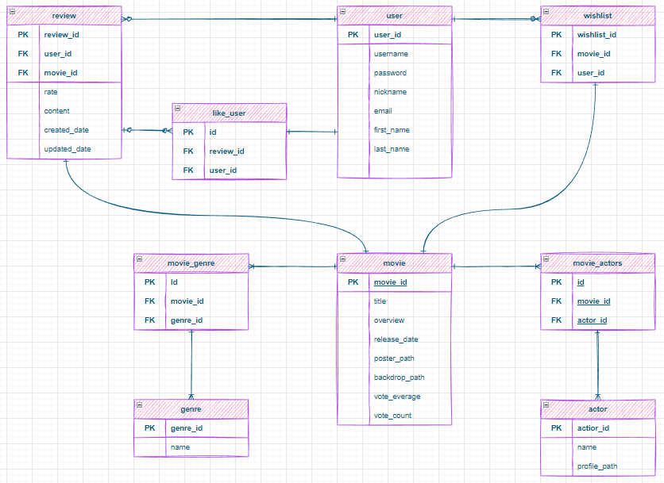
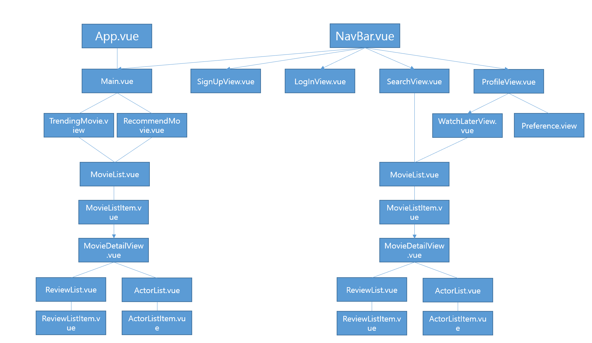

# ssafy-final-pjt
## 나의 Play-list Selecting 파트너

- 최신 유행 영화 추천
- 유저가 리뷰한 영화를 기준으로 유사한 장르의 영화를 추천
- TMDB API로 영화 정보 실시간 업데이트

## 팀원
- 이승희 (프론트엔드 담당)
    - 백엔드 데이터를 받아와 프론트 엔드 기능 구현
    - 프론트엔드 컴포넌트 설계, 디자인

- 조재경 (백엔드 담당)
    - 백엔드 데이터베이스 모델링
    - API 설계, 개발

## 데이터베이스 모델링

## 컴포넌트 구조

## 영화 추천 알고리즘

- 최신 유행 영화 추천
    - TMDB 기준 오늘 유행하는 영화 20개 추천

- 사용자 맞춤 영화 추천
    - 사용자가 많이 본 영화 장르에 기반해 추천
    1. 리뷰 작성한 영화를 기준으로 상위 장르들을 선정
    2. DB 내에서 유사 장르들의 영화를 선정
    3. 선정한 영화들의 평점을 기준으로 상위 20개 영화 추천

## 서비스 기능

## 느낀점

